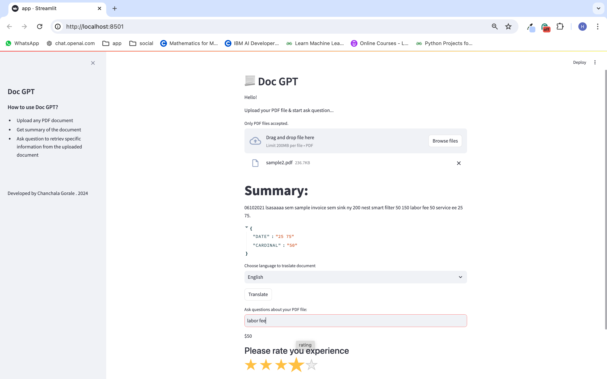

# Doc GPT

# Install Required Libraries

- pip install transformers spacy streamlit pdfplumber pytesseract nltk streamlit_star_rating

- pip install langchain_text_splitters langchain_openai langchain_community langchain

# Start App

Run: Streamlit run app.py

# How to use app

- Upload PDF file
- Get file summary
- Get entities & tokens
- Translate information to selected language
- Ask relevant questions with respect to uploaded file

# Finally rate the app

Now, if you like the experience, give 5 rating!

# Project Overview: Doc GPT

## PDF Processing:

Extract Text and Images: Uses pdfplumber to extract text from PDF pages and pytesseract to perform OCR on images within the PDF.

## Text Cleaning and Processing:

- Clean Text: Uses regex to remove special characters and extra whitespace, and normalizes text to lowercase.
- Sentence Segmentation and Tokenization: Uses nltk for sentence segmentation and tokenization.

## Entity Recognition and Classification:

NER and Relationship Extraction: Utilizes spacy and transformers' pipelines for named entity recognition and text classification.

## Translation:

Language Detection and Translation: Uses langdetect to detect the language and transformers MarianMTModel for translation to English.

## Summarization:

Text Summarization: Employs transformers summarization pipeline to generate summaries of the document content.

## Question Answering:

QA System: Implements langchain to create a question-answering system using OpenAI's language models, with text splitters and vector stores for efficient information retrieval.

## User Interface:

Streamlit Interface: Provides a user-friendly interface for uploading PDFs, viewing summaries, extracting entities and key-value pairs, translating text, and asking questions.

# Why OpenAI is Good for LLM Projects

## High-Quality Models

OpenAI provides state-of-the-art language models that excel in natural language understanding and generation tasks, ensuring accurate and contextually relevant responses.

## Versatility

OpenAI's models can handle a wide range of tasks, from text summarization and translation to question answering and text classification, making them highly versatile for various applications.

## Ease of Integration

OpenAI's API is straightforward to integrate into existing systems, with robust libraries and support for multiple programming languages, facilitating quick and efficient development.

## Scalability

OpenAI's infrastructure is designed to scale, allowing developers to handle large volumes of requests and data, which is crucial for applications requiring high throughput and reliability.

## Continuous Improvement

OpenAI continuously updates and improves its models, incorporating the latest research advancements to provide cutting-edge performance and capabilities.

## Comprehensive Documentation

OpenAI offers extensive documentation and resources, including tutorials, examples, and a supportive developer community, which helps streamline the development process and resolve issues effectively.
